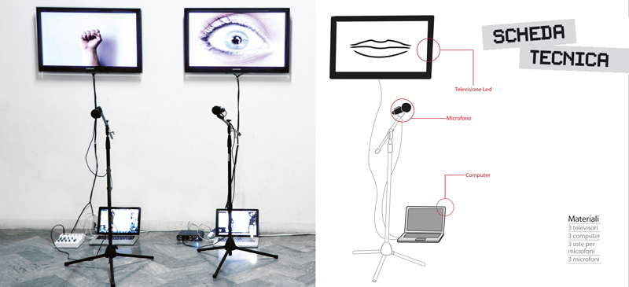

MOB
---
> *Mano, occhio, bocca*

## Concept
Mob è un'installazione composta da tre schermi su cui appaiono rispettivamente una mano, un occhio  ed una bocca. Queste tre parti anatomiche rispondono agli stimoli sonori dell'ambiente circostante e ai suoni generati dai fruitori dell'opera: esse si animano muovendosi in accordo con le diverse frequenze emesse dai visitatori, producendo una reazione di empatia interattiva.

Le parti anatomiche rappresentate sono state scelte in quanto parti coinvolte nel funzionamento e nell'attivazione dei neuroni specchio. Grazie ai neuroni specchio l'osservazione di un'azione induce nell'osservatore l'attivazione dello stesso circuito nervoso deputato a controllarne l'esecuzione: in altre parole l'osservazione di un'azione induce ennl'osservatore l'automatica simulazione in termini 'viscero-motori', di quell'azione.

Questo comportamento bio-sociale che mette in relazione le azioni esterne eseguite da altri con il repertorio interno di azioni dell'osservatore consente una comprensione implicita di ciò che viene osservato, dando vita ad una condizione di 'partecipazione empatica' che si manifesta attraverso un meccanismo neurale, ad un livello che precede la comunicazione linguistica.

## Esecuzione 

Per eseguirlo è sufficiente scaricare l'ultima versione di Processing dal seguente link: 
<https://processing.org/download/>

Il passo successivo consiste nell'eseguire il file `mob_rasp.pde` ed avviarlo, tutto qui! 

## Links
- http://nuovetecnologiedellarte.it/
- https://processing.org/

## License

### Code and images
MIT License: see [the `LICENSE` file] ().